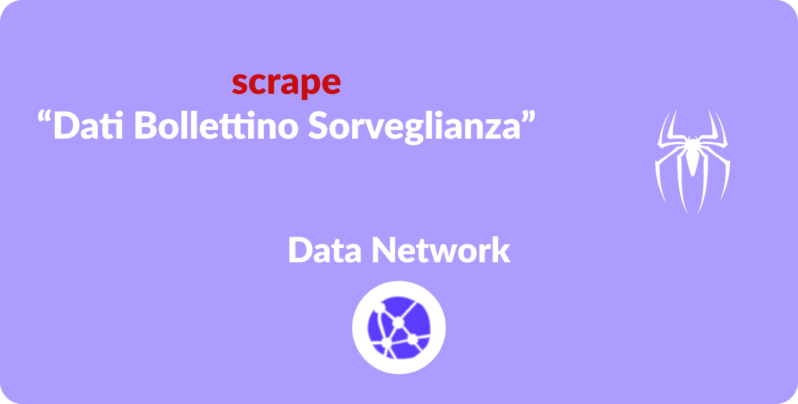
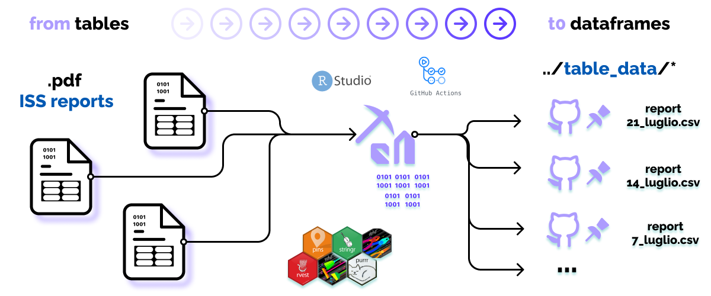

<!-- README.md is generated from README.Rmd. Please edit that file -->

```{r, echo = FALSE}

knitr::opts_chunk$set(
  collapse = TRUE,
  warning = FALSE, 
  message = FALSE,
  strip.white = TRUE,
  comment = "#>",
  fig.path = "img/",
  fig.width=12,
  fig.height=8,
  cache = FALSE
)

## to center img set  `imgcenter = TRUE` in the chuck option

knitr::knit_hooks$set(imgcenter = function(before, options, envir){  
  if (before) {                                                     
    htmltools::HTML("<p align='center'>")
  } else {
    htmltools::HTML("</p>")
  }
})

## libs
library(knitr, warn.conflicts = F, quietly = T)
library(here, warn.conflicts = F, quietly = T)
library(magrittr, warn.conflicts = F, quietly = T)


```


<!-- Add banner here -->



<!-- badges: start -->

<!-- GH action badge -->

[](https://github.com/Data-Network-Lab/dati-bollettino-sorveglianza/actions/workflows/update-data.yaml)


[](https://github.com/Data-Network-Lab/indicatore_zona_gialla/network)


<!-- badges: end -->

## [Table of contents](#table-of-contents)

Here there is the overview of the topics covered within this repo:

-   [Description](#description)
-   [Data](#data)
-   [Installation](#installation)
-   [Usage](#usage)
-   [Contribute and Conduct](#contribute-and-conduct)
-   [Sponsors](#sponsors)
-   [License](#license)

## Description

[(Back to top)](#table-of-contents)

<!-- Describe your project in brief -->

This project has the aim to **open source** data contained in the **ISS** spin off:
[EPICENTRO](https://www.epicentro.iss.it/) (epidemiologia per la sanità
pubblica) in their weekly integrated COVID-19 surveillance bullettin (in
Italy). Data comes daily in a .xlsx format, divided by sheets making weekly and monthly checks a little bit hard to digest for non practioners.
This bullettin is a product of **ISS** (Istituto Superiore di
Sanità) and it reports data infection cases throughout Italy in
compliance with the Order: *Ordinanza n. 640 del 27 febbraio 2020*. ISS
gathers data from a centralized and dedicated web application regarding
the number of confirmed cases through molecular (PCR) and antigenic
tests. Data are grouped daily from each single regions/PA (Provincia
Autonoma) even though some data might take a few days to be updated. For
this reason it might also be the case of discrepancy from data published
by the **Ministry of Health**, which reports aggregated data. Data
grouped as such, like in every emergency state case, might be incomplete
and missing. One example can involve the lag days between the tampon and
its result to the entry in the database. As a result the number of cases
should be interpreted as *temporary*. The bulletin describes with graphs
and **Tables** the diffusion in time & space of COVID-19 and it provides
also people characteristics (such as age, gender...) The reports have
also changed overtime to adapt to readers so the table format might
change. This was the challenge fronted in this repo: handling different
table formats and delivering the same result.

data source:

-   [ISS Epicentro Sorveglianza Integrata](https://www.epicentro.iss.it/coronavirus/sars-cov-2-sorveglianza-dati)

Some examples of reports:

-   [Report of 23-giugno-2021](https://www.epicentro.iss.it/coronavirus/bollettino/Bollettino-sorveglianza-integrata-COVID-19_23-giugno-2021.pdf)
-   [Report of 21-aprile-2021](https://www.epicentro.iss.it/coronavirus/bollettino/Bollettino-sorveglianza-integrata-COVID-19_21-aprile-2021.pdf)


## Data

[(Back to top)](#table-of-contents)


```{r TableData, echo=F}
## scrivi un .rds con tutti i risultati dei dati e qui leggilo


list.files(here("data", "OPENDATA"), full.names = T) %>% 
  kable(format = "markdown")

```

## Installation

[(Back to top)](#table-of-contents)

\*You might have noticed the **Back to top** button(if not, please
notice, it's right there above!). This is a good idea because it makes
this README **easy to navigate.** If you are willing to install this
project on your machine the recommended choice is to clone the repo on
you machine by executing:

`git init`

`git clone https://github.com/Data-Network-Lab/dati-bollettino-sorveglianza.git`

Then once you are done you might execute:

``` r
if(!require(renv)){
    install.packages("renv")
}

library(renv)
restore()
```

**Author Disclaimer**: `renv` is *not* a panacea for reproducibility, as
many people believe. Reproducible projects can be made easier with this
tool, which records the versions of R + R packages being used in a
project and provides tools for reinstalling those packages in a project
to their declared versions.

## Usage

[(Back to top)](#table-of-contents)

The pipeline is articulated in **3 phases**:

-   mine data from [source](https://www.epicentro.iss.it/coronavirus/open-data/OPENDATA-2021.zip) & unzip files in `..\OPENDATA\*`
-   parse .xlsx and group historical data per sheets. In the end reproduce visualizations in [ISS reports](https://www.epicentro.iss.it/coronavirus/bollettino/Bollettino-sorveglianza-integrata-COVID-19_23-giugno-2021.pdf)
-   `pins` data in `..data\archibve_sheet_data\*`



Ultimately this data might help analysts to integrate their own research
with a fresh outline on **cases divided by gender and age spans**.


Contributors and users can take advantage of this scraped data
(`../data/*`) for usages adhering to the license and by keeping in mind both chronic retard and possibile mistakes in data.

If you are either forking the project or contributing to it please make
sure you have correctly set up your `GITHUB_PAT` envir variable

``` r
nchar(Sys.getenv("GITHUB_PAT")) > 0
```

... and correctly paired your R project (with `board_register_github()`)
to your forked repo.

``` r
pins::board_register_github("<your_name>/<your_repo>")
```

## Contribute and Conduct

[(Back to top)](#table-of-contents)

Please note that the dati-bollettino-sorveglianza project is released
with a [Contributor Code of
Conduct](https://contributor-covenant.org/version/2/0/CODE_OF_CONDUCT.html).
By contributing to this project, you agree to abide by its terms.

## Sponsors

[(Back to top)](#table-of-contents)

[](https://ko-fi.com/N4N83TE3Z)

This project is currently not sponsored. If you are willing to support
our open source work tap the button above or simply donate at the link
you find in the upper right hand site of this repo (i.e. [DN
donations](https://datanetwork.xyz/donazioni/)). If you are interested
to be contacted for future works or collaboration please reach us out at
\@ [datanetworkxyz\@gmail.com](mailto:datanetworkxyz@gmail.com) for any
sort of enquiry or question you might bump into.

## License

[(Back to top)](#table-of-contents)

Please visit the LICENSE.md file.

<!-- Add the footer here -->


