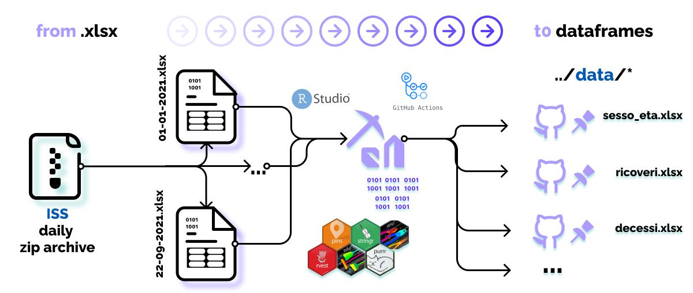

<!-- README.md is generated from README.Rmd. Please edit that file -->
<!-- Add banner here -->

<!-- badges: start -->
<!-- GH action badge -->

<!-- badges: end -->

## [Table of contents](#table-of-contents)

Here there is the overview of the topics covered within this repo:

-   [Description](#description)
-   [Data](#data)
-   [Installation](#installation)
-   [Usage](#usage)
-   [Contribute and Conduct](#contribute-and-conduct)
-   [Sponsors](#sponsors)
-   [License](#license)

## Description

[(Back to top)](#table-of-contents)

<!-- Describe your project in brief -->

This project has the aim to **open source** data contained in tables
reported by the **ISS** spin off:
[EPICENTRO](https://www.epicentro.iss.it/) (epidemiologia per la sanità
pubblica) in their weekly integrated COVID-19 surveillance bullettin (in
Italy). This bullettin is a product of **ISS** (Istituto Superiore di
Sanità) and it reports data infection cases throughout Italy in
compliance with the Order: *Ordinanza n. 640 del 27 febbraio 2020*. ISS
gathers data from a centralized and dedicated web application regarding
the number of confirmed cases through molecular (PCR) and antigenic
tests. Data are grouped daily from each single regions/PA (Provincia
Autonoma) even though some data might take a few days to be updated. For
this reason it might also be the case of discrepancy from data published
by the **Ministry of Health**, which reports aggregated data. Data
grouped as such, like in every emergency state case, might be incomplete
and missing. One example can involve the lag days between the tampon and
its result to the entry in the database. As a result the number of cases
should be interpreted as *temporary*. The bulletin describes with graphs
and **Tables** the diffusion in time & space of COVID-19 and it provides
also people characteristics (such as age, gender…) The reports have also
changed overtime to adapt to readers so the table format might change.
This was the challenge fronted in this repo: handling different table
formats and delivering the same result.

data source:

-   [ISS Epicentro Sorveglianza
    Integrata](https://www.epicentro.iss.it/coronavirus/sars-cov-2-sorveglianza-dati)

Some examples of reports:

-   [Report of
    23-giugno-2021](https://www.epicentro.iss.it/coronavirus/bollettino/Bollettino-sorveglianza-integrata-COVID-19_23-giugno-2021.pdf)
-   [Report of
    21-aprile-2021](https://www.epicentro.iss.it/coronavirus/bollettino/Bollettino-sorveglianza-integrata-COVID-19_21-aprile-2021.pdf)

## Data

[(Back to top)](#table-of-contents)

<table>
<colgroup>
<col style="width: 100%" />
</colgroup>
<thead>
<tr class="header">
<th style="text-align: left;">x</th>
</tr>
</thead>
<tbody>
<tr class="odd">
<td style="text-align: left;">C:/Users/nicco/Desktop/Progetti_R/dati-bollettino-sorveglianza/data/data-raw/COVID_19_ISS_open_data_2020-12-07.xlsx</td>
</tr>
<tr class="even">
<td style="text-align: left;">C:/Users/nicco/Desktop/Progetti_R/dati-bollettino-sorveglianza/data/data-raw/COVID_19_ISS_open_data_2021-01-01.xlsx</td>
</tr>
<tr class="odd">
<td style="text-align: left;">C:/Users/nicco/Desktop/Progetti_R/dati-bollettino-sorveglianza/data/data-raw/COVID_19_ISS_open_data_2021-01-02.xlsx</td>
</tr>
<tr class="even">
<td style="text-align: left;">C:/Users/nicco/Desktop/Progetti_R/dati-bollettino-sorveglianza/data/data-raw/COVID_19_ISS_open_data_2021-01-03.xlsx</td>
</tr>
<tr class="odd">
<td style="text-align: left;">C:/Users/nicco/Desktop/Progetti_R/dati-bollettino-sorveglianza/data/data-raw/COVID_19_ISS_open_data_2021-01-04.xlsx</td>
</tr>
<tr class="even">
<td style="text-align: left;">C:/Users/nicco/Desktop/Progetti_R/dati-bollettino-sorveglianza/data/data-raw/COVID_19_ISS_open_data_2021-01-05.xlsx</td>
</tr>
<tr class="odd">
<td style="text-align: left;">C:/Users/nicco/Desktop/Progetti_R/dati-bollettino-sorveglianza/data/data-raw/COVID_19_ISS_open_data_2021-01-06.xlsx</td>
</tr>
<tr class="even">
<td style="text-align: left;">C:/Users/nicco/Desktop/Progetti_R/dati-bollettino-sorveglianza/data/data-raw/COVID_19_ISS_open_data_2021-01-07.xlsx</td>
</tr>
<tr class="odd">
<td style="text-align: left;">C:/Users/nicco/Desktop/Progetti_R/dati-bollettino-sorveglianza/data/data-raw/COVID_19_ISS_open_data_2021-01-08.xlsx</td>
</tr>
<tr class="even">
<td style="text-align: left;">C:/Users/nicco/Desktop/Progetti_R/dati-bollettino-sorveglianza/data/data-raw/COVID_19_ISS_open_data_2021-01-09.xlsx</td>
</tr>
<tr class="odd">
<td style="text-align: left;">C:/Users/nicco/Desktop/Progetti_R/dati-bollettino-sorveglianza/data/data-raw/COVID_19_ISS_open_data_2021-01-10.xlsx</td>
</tr>
<tr class="even">
<td style="text-align: left;">C:/Users/nicco/Desktop/Progetti_R/dati-bollettino-sorveglianza/data/data-raw/COVID_19_ISS_open_data_2021-01-11.xlsx</td>
</tr>
<tr class="odd">
<td style="text-align: left;">C:/Users/nicco/Desktop/Progetti_R/dati-bollettino-sorveglianza/data/data-raw/COVID_19_ISS_open_data_2021-01-12.xlsx</td>
</tr>
<tr class="even">
<td style="text-align: left;">C:/Users/nicco/Desktop/Progetti_R/dati-bollettino-sorveglianza/data/data-raw/COVID_19_ISS_open_data_2021-01-13.xlsx</td>
</tr>
<tr class="odd">
<td style="text-align: left;">C:/Users/nicco/Desktop/Progetti_R/dati-bollettino-sorveglianza/data/data-raw/COVID_19_ISS_open_data_2021-01-14.xlsx</td>
</tr>
<tr class="even">
<td style="text-align: left;">C:/Users/nicco/Desktop/Progetti_R/dati-bollettino-sorveglianza/data/data-raw/COVID_19_ISS_open_data_2021-01-15.xlsx</td>
</tr>
<tr class="odd">
<td style="text-align: left;">C:/Users/nicco/Desktop/Progetti_R/dati-bollettino-sorveglianza/data/data-raw/COVID_19_ISS_open_data_2021-01-16.xlsx</td>
</tr>
<tr class="even">
<td style="text-align: left;">C:/Users/nicco/Desktop/Progetti_R/dati-bollettino-sorveglianza/data/data-raw/COVID_19_ISS_open_data_2021-01-17.xlsx</td>
</tr>
<tr class="odd">
<td style="text-align: left;">C:/Users/nicco/Desktop/Progetti_R/dati-bollettino-sorveglianza/data/data-raw/COVID_19_ISS_open_data_2021-01-19.xlsx</td>
</tr>
<tr class="even">
<td style="text-align: left;">C:/Users/nicco/Desktop/Progetti_R/dati-bollettino-sorveglianza/data/data-raw/COVID_19_ISS_open_data_2021-01-21.xlsx</td>
</tr>
<tr class="odd">
<td style="text-align: left;">C:/Users/nicco/Desktop/Progetti_R/dati-bollettino-sorveglianza/data/data-raw/COVID_19_ISS_open_data_2021-01-22.xlsx</td>
</tr>
<tr class="even">
<td style="text-align: left;">C:/Users/nicco/Desktop/Progetti_R/dati-bollettino-sorveglianza/data/data-raw/COVID_19_ISS_open_data_2021-01-23.xlsx</td>
</tr>
<tr class="odd">
<td style="text-align: left;">C:/Users/nicco/Desktop/Progetti_R/dati-bollettino-sorveglianza/data/data-raw/COVID_19_ISS_open_data_2021-01-24.xlsx</td>
</tr>
<tr class="even">
<td style="text-align: left;">C:/Users/nicco/Desktop/Progetti_R/dati-bollettino-sorveglianza/data/data-raw/COVID_19_ISS_open_data_2021-01-25.xlsx</td>
</tr>
<tr class="odd">
<td style="text-align: left;">C:/Users/nicco/Desktop/Progetti_R/dati-bollettino-sorveglianza/data/data-raw/COVID_19_ISS_open_data_2021-01-26.xlsx</td>
</tr>
<tr class="even">
<td style="text-align: left;">C:/Users/nicco/Desktop/Progetti_R/dati-bollettino-sorveglianza/data/data-raw/COVID_19_ISS_open_data_2021-01-27.xlsx</td>
</tr>
<tr class="odd">
<td style="text-align: left;">C:/Users/nicco/Desktop/Progetti_R/dati-bollettino-sorveglianza/data/data-raw/COVID_19_ISS_open_data_2021-01-28.xlsx</td>
</tr>
<tr class="even">
<td style="text-align: left;">C:/Users/nicco/Desktop/Progetti_R/dati-bollettino-sorveglianza/data/data-raw/COVID_19_ISS_open_data_2021-01-29.xlsx</td>
</tr>
<tr class="odd">
<td style="text-align: left;">C:/Users/nicco/Desktop/Progetti_R/dati-bollettino-sorveglianza/data/data-raw/COVID_19_ISS_open_data_2021-01-30.xlsx</td>
</tr>
<tr class="even">
<td style="text-align: left;">C:/Users/nicco/Desktop/Progetti_R/dati-bollettino-sorveglianza/data/data-raw/COVID_19_ISS_open_data_2021-01-31.xlsx</td>
</tr>
<tr class="odd">
<td style="text-align: left;">C:/Users/nicco/Desktop/Progetti_R/dati-bollettino-sorveglianza/data/data-raw/COVID_19_ISS_open_data_2021-02-01.xlsx</td>
</tr>
<tr class="even">
<td style="text-align: left;">C:/Users/nicco/Desktop/Progetti_R/dati-bollettino-sorveglianza/data/data-raw/COVID_19_ISS_open_data_2021-02-02.xlsx</td>
</tr>
<tr class="odd">
<td style="text-align: left;">C:/Users/nicco/Desktop/Progetti_R/dati-bollettino-sorveglianza/data/data-raw/COVID_19_ISS_open_data_2021-02-03.xlsx</td>
</tr>
<tr class="even">
<td style="text-align: left;">C:/Users/nicco/Desktop/Progetti_R/dati-bollettino-sorveglianza/data/data-raw/COVID_19_ISS_open_data_2021-02-04.xlsx</td>
</tr>
<tr class="odd">
<td style="text-align: left;">C:/Users/nicco/Desktop/Progetti_R/dati-bollettino-sorveglianza/data/data-raw/COVID_19_ISS_open_data_2021-02-04_corrected.xlsx</td>
</tr>
<tr class="even">
<td style="text-align: left;">C:/Users/nicco/Desktop/Progetti_R/dati-bollettino-sorveglianza/data/data-raw/COVID_19_ISS_open_data_2021-02-05.xlsx</td>
</tr>
<tr class="odd">
<td style="text-align: left;">C:/Users/nicco/Desktop/Progetti_R/dati-bollettino-sorveglianza/data/data-raw/COVID_19_ISS_open_data_2021-02-06.xlsx</td>
</tr>
<tr class="even">
<td style="text-align: left;">C:/Users/nicco/Desktop/Progetti_R/dati-bollettino-sorveglianza/data/data-raw/COVID_19_ISS_open_data_2021-02-07.xlsx</td>
</tr>
<tr class="odd">
<td style="text-align: left;">C:/Users/nicco/Desktop/Progetti_R/dati-bollettino-sorveglianza/data/data-raw/COVID_19_ISS_open_data_2021-02-08.xlsx</td>
</tr>
<tr class="even">
<td style="text-align: left;">C:/Users/nicco/Desktop/Progetti_R/dati-bollettino-sorveglianza/data/data-raw/COVID_19_ISS_open_data_2021-02-09.xlsx</td>
</tr>
<tr class="odd">
<td style="text-align: left;">C:/Users/nicco/Desktop/Progetti_R/dati-bollettino-sorveglianza/data/data-raw/COVID_19_ISS_open_data_2021-02-10.xlsx</td>
</tr>
<tr class="even">
<td style="text-align: left;">C:/Users/nicco/Desktop/Progetti_R/dati-bollettino-sorveglianza/data/data-raw/COVID_19_ISS_open_data_2021-02-11.xlsx</td>
</tr>
<tr class="odd">
<td style="text-align: left;">C:/Users/nicco/Desktop/Progetti_R/dati-bollettino-sorveglianza/data/data-raw/COVID_19_ISS_open_data_2021-02-12.xlsx</td>
</tr>
<tr class="even">
<td style="text-align: left;">C:/Users/nicco/Desktop/Progetti_R/dati-bollettino-sorveglianza/data/data-raw/COVID_19_ISS_open_data_2021-02-13.xlsx</td>
</tr>
<tr class="odd">
<td style="text-align: left;">C:/Users/nicco/Desktop/Progetti_R/dati-bollettino-sorveglianza/data/data-raw/COVID_19_ISS_open_data_2021-02-14.xlsx</td>
</tr>
<tr class="even">
<td style="text-align: left;">C:/Users/nicco/Desktop/Progetti_R/dati-bollettino-sorveglianza/data/data-raw/COVID_19_ISS_open_data_2021-02-15.xlsx</td>
</tr>
<tr class="odd">
<td style="text-align: left;">C:/Users/nicco/Desktop/Progetti_R/dati-bollettino-sorveglianza/data/data-raw/COVID_19_ISS_open_data_2021-02-16.xlsx</td>
</tr>
<tr class="even">
<td style="text-align: left;">C:/Users/nicco/Desktop/Progetti_R/dati-bollettino-sorveglianza/data/data-raw/COVID_19_ISS_open_data_2021-02-17.xlsx</td>
</tr>
<tr class="odd">
<td style="text-align: left;">C:/Users/nicco/Desktop/Progetti_R/dati-bollettino-sorveglianza/data/data-raw/COVID_19_ISS_open_data_2021-02-18.xlsx</td>
</tr>
<tr class="even">
<td style="text-align: left;">C:/Users/nicco/Desktop/Progetti_R/dati-bollettino-sorveglianza/data/data-raw/COVID_19_ISS_open_data_2021-02-19.xlsx</td>
</tr>
<tr class="odd">
<td style="text-align: left;">C:/Users/nicco/Desktop/Progetti_R/dati-bollettino-sorveglianza/data/data-raw/COVID_19_ISS_open_data_2021-02-20.xlsx</td>
</tr>
<tr class="even">
<td style="text-align: left;">C:/Users/nicco/Desktop/Progetti_R/dati-bollettino-sorveglianza/data/data-raw/COVID_19_ISS_open_data_2021-02-21.xlsx</td>
</tr>
<tr class="odd">
<td style="text-align: left;">C:/Users/nicco/Desktop/Progetti_R/dati-bollettino-sorveglianza/data/data-raw/COVID_19_ISS_open_data_2021-02-22.xlsx</td>
</tr>
<tr class="even">
<td style="text-align: left;">C:/Users/nicco/Desktop/Progetti_R/dati-bollettino-sorveglianza/data/data-raw/COVID_19_ISS_open_data_2021-02-23.xlsx</td>
</tr>
<tr class="odd">
<td style="text-align: left;">C:/Users/nicco/Desktop/Progetti_R/dati-bollettino-sorveglianza/data/data-raw/COVID_19_ISS_open_data_2021-02-24.xlsx</td>
</tr>
<tr class="even">
<td style="text-align: left;">C:/Users/nicco/Desktop/Progetti_R/dati-bollettino-sorveglianza/data/data-raw/COVID_19_ISS_open_data_2021-02-25.xlsx</td>
</tr>
<tr class="odd">
<td style="text-align: left;">C:/Users/nicco/Desktop/Progetti_R/dati-bollettino-sorveglianza/data/data-raw/COVID_19_ISS_open_data_2021-02-26.xlsx</td>
</tr>
<tr class="even">
<td style="text-align: left;">C:/Users/nicco/Desktop/Progetti_R/dati-bollettino-sorveglianza/data/data-raw/COVID_19_ISS_open_data_2021-02-27.xlsx</td>
</tr>
<tr class="odd">
<td style="text-align: left;">C:/Users/nicco/Desktop/Progetti_R/dati-bollettino-sorveglianza/data/data-raw/COVID_19_ISS_open_data_2021-02-28.xlsx</td>
</tr>
<tr class="even">
<td style="text-align: left;">C:/Users/nicco/Desktop/Progetti_R/dati-bollettino-sorveglianza/data/data-raw/COVID_19_ISS_open_data_2021-03-01.xlsx</td>
</tr>
<tr class="odd">
<td style="text-align: left;">C:/Users/nicco/Desktop/Progetti_R/dati-bollettino-sorveglianza/data/data-raw/COVID_19_ISS_open_data_2021-03-02.xlsx</td>
</tr>
<tr class="even">
<td style="text-align: left;">C:/Users/nicco/Desktop/Progetti_R/dati-bollettino-sorveglianza/data/data-raw/COVID_19_ISS_open_data_2021-03-03.xlsx</td>
</tr>
<tr class="odd">
<td style="text-align: left;">C:/Users/nicco/Desktop/Progetti_R/dati-bollettino-sorveglianza/data/data-raw/COVID_19_ISS_open_data_2021-03-04.xlsx</td>
</tr>
<tr class="even">
<td style="text-align: left;">C:/Users/nicco/Desktop/Progetti_R/dati-bollettino-sorveglianza/data/data-raw/COVID_19_ISS_open_data_2021-03-05.xlsx</td>
</tr>
<tr class="odd">
<td style="text-align: left;">C:/Users/nicco/Desktop/Progetti_R/dati-bollettino-sorveglianza/data/data-raw/COVID_19_ISS_open_data_2021-03-06.xlsx</td>
</tr>
<tr class="even">
<td style="text-align: left;">C:/Users/nicco/Desktop/Progetti_R/dati-bollettino-sorveglianza/data/data-raw/COVID_19_ISS_open_data_2021-03-07.xlsx</td>
</tr>
<tr class="odd">
<td style="text-align: left;">C:/Users/nicco/Desktop/Progetti_R/dati-bollettino-sorveglianza/data/data-raw/COVID_19_ISS_open_data_2021-03-08.xlsx</td>
</tr>
<tr class="even">
<td style="text-align: left;">C:/Users/nicco/Desktop/Progetti_R/dati-bollettino-sorveglianza/data/data-raw/COVID_19_ISS_open_data_2021-03-09.xlsx</td>
</tr>
<tr class="odd">
<td style="text-align: left;">C:/Users/nicco/Desktop/Progetti_R/dati-bollettino-sorveglianza/data/data-raw/COVID_19_ISS_open_data_2021-03-10.xlsx</td>
</tr>
<tr class="even">
<td style="text-align: left;">C:/Users/nicco/Desktop/Progetti_R/dati-bollettino-sorveglianza/data/data-raw/COVID_19_ISS_open_data_2021-03-11.xlsx</td>
</tr>
<tr class="odd">
<td style="text-align: left;">C:/Users/nicco/Desktop/Progetti_R/dati-bollettino-sorveglianza/data/data-raw/COVID_19_ISS_open_data_2021-03-12.xlsx</td>
</tr>
<tr class="even">
<td style="text-align: left;">C:/Users/nicco/Desktop/Progetti_R/dati-bollettino-sorveglianza/data/data-raw/COVID_19_ISS_open_data_2021-03-13.xlsx</td>
</tr>
<tr class="odd">
<td style="text-align: left;">C:/Users/nicco/Desktop/Progetti_R/dati-bollettino-sorveglianza/data/data-raw/COVID_19_ISS_open_data_2021-03-14.xlsx</td>
</tr>
<tr class="even">
<td style="text-align: left;">C:/Users/nicco/Desktop/Progetti_R/dati-bollettino-sorveglianza/data/data-raw/COVID_19_ISS_open_data_2021-03-15.xlsx</td>
</tr>
<tr class="odd">
<td style="text-align: left;">C:/Users/nicco/Desktop/Progetti_R/dati-bollettino-sorveglianza/data/data-raw/COVID_19_ISS_open_data_2021-03-16.xlsx</td>
</tr>
<tr class="even">
<td style="text-align: left;">C:/Users/nicco/Desktop/Progetti_R/dati-bollettino-sorveglianza/data/data-raw/COVID_19_ISS_open_data_2021-03-17.xlsx</td>
</tr>
<tr class="odd">
<td style="text-align: left;">C:/Users/nicco/Desktop/Progetti_R/dati-bollettino-sorveglianza/data/data-raw/COVID_19_ISS_open_data_2021-03-18.xlsx</td>
</tr>
<tr class="even">
<td style="text-align: left;">C:/Users/nicco/Desktop/Progetti_R/dati-bollettino-sorveglianza/data/data-raw/COVID_19_ISS_open_data_2021-03-19.xlsx</td>
</tr>
<tr class="odd">
<td style="text-align: left;">C:/Users/nicco/Desktop/Progetti_R/dati-bollettino-sorveglianza/data/data-raw/COVID_19_ISS_open_data_2021-03-20.xlsx</td>
</tr>
<tr class="even">
<td style="text-align: left;">C:/Users/nicco/Desktop/Progetti_R/dati-bollettino-sorveglianza/data/data-raw/COVID_19_ISS_open_data_2021-03-21.xlsx</td>
</tr>
<tr class="odd">
<td style="text-align: left;">C:/Users/nicco/Desktop/Progetti_R/dati-bollettino-sorveglianza/data/data-raw/COVID_19_ISS_open_data_2021-03-22.xlsx</td>
</tr>
<tr class="even">
<td style="text-align: left;">C:/Users/nicco/Desktop/Progetti_R/dati-bollettino-sorveglianza/data/data-raw/COVID_19_ISS_open_data_2021-03-23.xlsx</td>
</tr>
<tr class="odd">
<td style="text-align: left;">C:/Users/nicco/Desktop/Progetti_R/dati-bollettino-sorveglianza/data/data-raw/COVID_19_ISS_open_data_2021-03-24.xlsx</td>
</tr>
<tr class="even">
<td style="text-align: left;">C:/Users/nicco/Desktop/Progetti_R/dati-bollettino-sorveglianza/data/data-raw/COVID_19_ISS_open_data_2021-03-25.xlsx</td>
</tr>
<tr class="odd">
<td style="text-align: left;">C:/Users/nicco/Desktop/Progetti_R/dati-bollettino-sorveglianza/data/data-raw/COVID_19_ISS_open_data_2021-03-26.xlsx</td>
</tr>
<tr class="even">
<td style="text-align: left;">C:/Users/nicco/Desktop/Progetti_R/dati-bollettino-sorveglianza/data/data-raw/COVID_19_ISS_open_data_2021-03-27.xlsx</td>
</tr>
<tr class="odd">
<td style="text-align: left;">C:/Users/nicco/Desktop/Progetti_R/dati-bollettino-sorveglianza/data/data-raw/COVID_19_ISS_open_data_2021-03-28.xlsx</td>
</tr>
<tr class="even">
<td style="text-align: left;">C:/Users/nicco/Desktop/Progetti_R/dati-bollettino-sorveglianza/data/data-raw/COVID_19_ISS_open_data_2021-03-29.xlsx</td>
</tr>
<tr class="odd">
<td style="text-align: left;">C:/Users/nicco/Desktop/Progetti_R/dati-bollettino-sorveglianza/data/data-raw/COVID_19_ISS_open_data_2021-03-30.xlsx</td>
</tr>
<tr class="even">
<td style="text-align: left;">C:/Users/nicco/Desktop/Progetti_R/dati-bollettino-sorveglianza/data/data-raw/COVID_19_ISS_open_data_2021-03-31.xlsx</td>
</tr>
<tr class="odd">
<td style="text-align: left;">C:/Users/nicco/Desktop/Progetti_R/dati-bollettino-sorveglianza/data/data-raw/COVID_19_ISS_open_data_2021-04-01.xlsx</td>
</tr>
<tr class="even">
<td style="text-align: left;">C:/Users/nicco/Desktop/Progetti_R/dati-bollettino-sorveglianza/data/data-raw/COVID_19_ISS_open_data_2021-04-02.xlsx</td>
</tr>
<tr class="odd">
<td style="text-align: left;">C:/Users/nicco/Desktop/Progetti_R/dati-bollettino-sorveglianza/data/data-raw/COVID_19_ISS_open_data_2021-04-03.xlsx</td>
</tr>
<tr class="even">
<td style="text-align: left;">C:/Users/nicco/Desktop/Progetti_R/dati-bollettino-sorveglianza/data/data-raw/COVID_19_ISS_open_data_2021-04-04.xlsx</td>
</tr>
<tr class="odd">
<td style="text-align: left;">C:/Users/nicco/Desktop/Progetti_R/dati-bollettino-sorveglianza/data/data-raw/COVID_19_ISS_open_data_2021-04-05.xlsx</td>
</tr>
<tr class="even">
<td style="text-align: left;">C:/Users/nicco/Desktop/Progetti_R/dati-bollettino-sorveglianza/data/data-raw/COVID_19_ISS_open_data_2021-04-06.xlsx</td>
</tr>
<tr class="odd">
<td style="text-align: left;">C:/Users/nicco/Desktop/Progetti_R/dati-bollettino-sorveglianza/data/data-raw/COVID_19_ISS_open_data_2021-04-07.xlsx</td>
</tr>
<tr class="even">
<td style="text-align: left;">C:/Users/nicco/Desktop/Progetti_R/dati-bollettino-sorveglianza/data/data-raw/COVID_19_ISS_open_data_2021-04-08.xlsx</td>
</tr>
<tr class="odd">
<td style="text-align: left;">C:/Users/nicco/Desktop/Progetti_R/dati-bollettino-sorveglianza/data/data-raw/COVID_19_ISS_open_data_2021-04-09.xlsx</td>
</tr>
<tr class="even">
<td style="text-align: left;">C:/Users/nicco/Desktop/Progetti_R/dati-bollettino-sorveglianza/data/data-raw/COVID_19_ISS_open_data_2021-04-10.xlsx</td>
</tr>
<tr class="odd">
<td style="text-align: left;">C:/Users/nicco/Desktop/Progetti_R/dati-bollettino-sorveglianza/data/data-raw/COVID_19_ISS_open_data_2021-04-11.xlsx</td>
</tr>
<tr class="even">
<td style="text-align: left;">C:/Users/nicco/Desktop/Progetti_R/dati-bollettino-sorveglianza/data/data-raw/COVID_19_ISS_open_data_2021-04-12.xlsx</td>
</tr>
<tr class="odd">
<td style="text-align: left;">C:/Users/nicco/Desktop/Progetti_R/dati-bollettino-sorveglianza/data/data-raw/COVID_19_ISS_open_data_2021-04-13.xlsx</td>
</tr>
<tr class="even">
<td style="text-align: left;">C:/Users/nicco/Desktop/Progetti_R/dati-bollettino-sorveglianza/data/data-raw/COVID_19_ISS_open_data_2021-04-14.xlsx</td>
</tr>
<tr class="odd">
<td style="text-align: left;">C:/Users/nicco/Desktop/Progetti_R/dati-bollettino-sorveglianza/data/data-raw/COVID_19_ISS_open_data_2021-04-15.xlsx</td>
</tr>
<tr class="even">
<td style="text-align: left;">C:/Users/nicco/Desktop/Progetti_R/dati-bollettino-sorveglianza/data/data-raw/COVID_19_ISS_open_data_2021-04-16.xlsx</td>
</tr>
<tr class="odd">
<td style="text-align: left;">C:/Users/nicco/Desktop/Progetti_R/dati-bollettino-sorveglianza/data/data-raw/COVID_19_ISS_open_data_2021-04-17.xlsx</td>
</tr>
<tr class="even">
<td style="text-align: left;">C:/Users/nicco/Desktop/Progetti_R/dati-bollettino-sorveglianza/data/data-raw/COVID_19_ISS_open_data_2021-04-18.xlsx</td>
</tr>
<tr class="odd">
<td style="text-align: left;">C:/Users/nicco/Desktop/Progetti_R/dati-bollettino-sorveglianza/data/data-raw/COVID_19_ISS_open_data_2021-04-19.xlsx</td>
</tr>
<tr class="even">
<td style="text-align: left;">C:/Users/nicco/Desktop/Progetti_R/dati-bollettino-sorveglianza/data/data-raw/COVID_19_ISS_open_data_2021-04-20.xlsx</td>
</tr>
<tr class="odd">
<td style="text-align: left;">C:/Users/nicco/Desktop/Progetti_R/dati-bollettino-sorveglianza/data/data-raw/COVID_19_ISS_open_data_2021-04-21.xlsx</td>
</tr>
<tr class="even">
<td style="text-align: left;">C:/Users/nicco/Desktop/Progetti_R/dati-bollettino-sorveglianza/data/data-raw/COVID_19_ISS_open_data_2021-04-22.xlsx</td>
</tr>
<tr class="odd">
<td style="text-align: left;">C:/Users/nicco/Desktop/Progetti_R/dati-bollettino-sorveglianza/data/data-raw/COVID_19_ISS_open_data_2021-04-23.xlsx</td>
</tr>
<tr class="even">
<td style="text-align: left;">C:/Users/nicco/Desktop/Progetti_R/dati-bollettino-sorveglianza/data/data-raw/COVID_19_ISS_open_data_2021-04-24.xlsx</td>
</tr>
<tr class="odd">
<td style="text-align: left;">C:/Users/nicco/Desktop/Progetti_R/dati-bollettino-sorveglianza/data/data-raw/COVID_19_ISS_open_data_2021-04-25.xlsx</td>
</tr>
<tr class="even">
<td style="text-align: left;">C:/Users/nicco/Desktop/Progetti_R/dati-bollettino-sorveglianza/data/data-raw/COVID_19_ISS_open_data_2021-04-26.xlsx</td>
</tr>
<tr class="odd">
<td style="text-align: left;">C:/Users/nicco/Desktop/Progetti_R/dati-bollettino-sorveglianza/data/data-raw/COVID_19_ISS_open_data_2021-04-27.xlsx</td>
</tr>
<tr class="even">
<td style="text-align: left;">C:/Users/nicco/Desktop/Progetti_R/dati-bollettino-sorveglianza/data/data-raw/COVID_19_ISS_open_data_2021-04-28.xlsx</td>
</tr>
<tr class="odd">
<td style="text-align: left;">C:/Users/nicco/Desktop/Progetti_R/dati-bollettino-sorveglianza/data/data-raw/COVID_19_ISS_open_data_2021-04-29.xlsx</td>
</tr>
<tr class="even">
<td style="text-align: left;">C:/Users/nicco/Desktop/Progetti_R/dati-bollettino-sorveglianza/data/data-raw/COVID_19_ISS_open_data_2021-04-30.xlsx</td>
</tr>
<tr class="odd">
<td style="text-align: left;">C:/Users/nicco/Desktop/Progetti_R/dati-bollettino-sorveglianza/data/data-raw/COVID_19_ISS_open_data_2021-05-01.xlsx</td>
</tr>
<tr class="even">
<td style="text-align: left;">C:/Users/nicco/Desktop/Progetti_R/dati-bollettino-sorveglianza/data/data-raw/COVID_19_ISS_open_data_2021-05-02.xlsx</td>
</tr>
<tr class="odd">
<td style="text-align: left;">C:/Users/nicco/Desktop/Progetti_R/dati-bollettino-sorveglianza/data/data-raw/COVID_19_ISS_open_data_2021-05-03.xlsx</td>
</tr>
<tr class="even">
<td style="text-align: left;">C:/Users/nicco/Desktop/Progetti_R/dati-bollettino-sorveglianza/data/data-raw/COVID_19_ISS_open_data_2021-05-04.xlsx</td>
</tr>
<tr class="odd">
<td style="text-align: left;">C:/Users/nicco/Desktop/Progetti_R/dati-bollettino-sorveglianza/data/data-raw/COVID_19_ISS_open_data_2021-05-05.xlsx</td>
</tr>
<tr class="even">
<td style="text-align: left;">C:/Users/nicco/Desktop/Progetti_R/dati-bollettino-sorveglianza/data/data-raw/COVID_19_ISS_open_data_2021-05-06.xlsx</td>
</tr>
<tr class="odd">
<td style="text-align: left;">C:/Users/nicco/Desktop/Progetti_R/dati-bollettino-sorveglianza/data/data-raw/COVID_19_ISS_open_data_2021-05-07.xlsx</td>
</tr>
<tr class="even">
<td style="text-align: left;">C:/Users/nicco/Desktop/Progetti_R/dati-bollettino-sorveglianza/data/data-raw/COVID_19_ISS_open_data_2021-05-08.xlsx</td>
</tr>
<tr class="odd">
<td style="text-align: left;">C:/Users/nicco/Desktop/Progetti_R/dati-bollettino-sorveglianza/data/data-raw/COVID_19_ISS_open_data_2021-05-09.xlsx</td>
</tr>
<tr class="even">
<td style="text-align: left;">C:/Users/nicco/Desktop/Progetti_R/dati-bollettino-sorveglianza/data/data-raw/COVID_19_ISS_open_data_2021-05-10.xlsx</td>
</tr>
<tr class="odd">
<td style="text-align: left;">C:/Users/nicco/Desktop/Progetti_R/dati-bollettino-sorveglianza/data/data-raw/COVID_19_ISS_open_data_2021-05-11.xlsx</td>
</tr>
<tr class="even">
<td style="text-align: left;">C:/Users/nicco/Desktop/Progetti_R/dati-bollettino-sorveglianza/data/data-raw/COVID_19_ISS_open_data_2021-05-12.xlsx</td>
</tr>
<tr class="odd">
<td style="text-align: left;">C:/Users/nicco/Desktop/Progetti_R/dati-bollettino-sorveglianza/data/data-raw/COVID_19_ISS_open_data_2021-05-13.xlsx</td>
</tr>
<tr class="even">
<td style="text-align: left;">C:/Users/nicco/Desktop/Progetti_R/dati-bollettino-sorveglianza/data/data-raw/COVID_19_ISS_open_data_2021-05-15.xlsx</td>
</tr>
<tr class="odd">
<td style="text-align: left;">C:/Users/nicco/Desktop/Progetti_R/dati-bollettino-sorveglianza/data/data-raw/COVID_19_ISS_open_data_2021-05-16.xlsx</td>
</tr>
<tr class="even">
<td style="text-align: left;">C:/Users/nicco/Desktop/Progetti_R/dati-bollettino-sorveglianza/data/data-raw/COVID_19_ISS_open_data_2021-05-17.xlsx</td>
</tr>
<tr class="odd">
<td style="text-align: left;">C:/Users/nicco/Desktop/Progetti_R/dati-bollettino-sorveglianza/data/data-raw/COVID_19_ISS_open_data_2021-05-18.xlsx</td>
</tr>
<tr class="even">
<td style="text-align: left;">C:/Users/nicco/Desktop/Progetti_R/dati-bollettino-sorveglianza/data/data-raw/COVID_19_ISS_open_data_2021-05-19.xlsx</td>
</tr>
<tr class="odd">
<td style="text-align: left;">C:/Users/nicco/Desktop/Progetti_R/dati-bollettino-sorveglianza/data/data-raw/COVID_19_ISS_open_data_2021-05-20.xlsx</td>
</tr>
<tr class="even">
<td style="text-align: left;">C:/Users/nicco/Desktop/Progetti_R/dati-bollettino-sorveglianza/data/data-raw/COVID_19_ISS_open_data_2021-05-21.xlsx</td>
</tr>
<tr class="odd">
<td style="text-align: left;">C:/Users/nicco/Desktop/Progetti_R/dati-bollettino-sorveglianza/data/data-raw/COVID_19_ISS_open_data_2021-05-22.xlsx</td>
</tr>
<tr class="even">
<td style="text-align: left;">C:/Users/nicco/Desktop/Progetti_R/dati-bollettino-sorveglianza/data/data-raw/COVID_19_ISS_open_data_2021-05-23.xlsx</td>
</tr>
<tr class="odd">
<td style="text-align: left;">C:/Users/nicco/Desktop/Progetti_R/dati-bollettino-sorveglianza/data/data-raw/COVID_19_ISS_open_data_2021-05-24.xlsx</td>
</tr>
<tr class="even">
<td style="text-align: left;">C:/Users/nicco/Desktop/Progetti_R/dati-bollettino-sorveglianza/data/data-raw/COVID_19_ISS_open_data_2021-05-25.xlsx</td>
</tr>
<tr class="odd">
<td style="text-align: left;">C:/Users/nicco/Desktop/Progetti_R/dati-bollettino-sorveglianza/data/data-raw/COVID_19_ISS_open_data_2021-05-26.xlsx</td>
</tr>
<tr class="even">
<td style="text-align: left;">C:/Users/nicco/Desktop/Progetti_R/dati-bollettino-sorveglianza/data/data-raw/COVID_19_ISS_open_data_2021-05-27.xlsx</td>
</tr>
<tr class="odd">
<td style="text-align: left;">C:/Users/nicco/Desktop/Progetti_R/dati-bollettino-sorveglianza/data/data-raw/COVID_19_ISS_open_data_2021-05-28.xlsx</td>
</tr>
<tr class="even">
<td style="text-align: left;">C:/Users/nicco/Desktop/Progetti_R/dati-bollettino-sorveglianza/data/data-raw/COVID_19_ISS_open_data_2021-05-29.xlsx</td>
</tr>
<tr class="odd">
<td style="text-align: left;">C:/Users/nicco/Desktop/Progetti_R/dati-bollettino-sorveglianza/data/data-raw/COVID_19_ISS_open_data_2021-05-30.xlsx</td>
</tr>
<tr class="even">
<td style="text-align: left;">C:/Users/nicco/Desktop/Progetti_R/dati-bollettino-sorveglianza/data/data-raw/COVID_19_ISS_open_data_2021-05-31.xlsx</td>
</tr>
<tr class="odd">
<td style="text-align: left;">C:/Users/nicco/Desktop/Progetti_R/dati-bollettino-sorveglianza/data/data-raw/COVID_19_ISS_open_data_2021-06-01.xlsx</td>
</tr>
<tr class="even">
<td style="text-align: left;">C:/Users/nicco/Desktop/Progetti_R/dati-bollettino-sorveglianza/data/data-raw/COVID_19_ISS_open_data_2021-06-02.xlsx</td>
</tr>
<tr class="odd">
<td style="text-align: left;">C:/Users/nicco/Desktop/Progetti_R/dati-bollettino-sorveglianza/data/data-raw/COVID_19_ISS_open_data_2021-06-03.xlsx</td>
</tr>
<tr class="even">
<td style="text-align: left;">C:/Users/nicco/Desktop/Progetti_R/dati-bollettino-sorveglianza/data/data-raw/COVID_19_ISS_open_data_2021-06-04.xlsx</td>
</tr>
<tr class="odd">
<td style="text-align: left;">C:/Users/nicco/Desktop/Progetti_R/dati-bollettino-sorveglianza/data/data-raw/COVID_19_ISS_open_data_2021-06-05.xlsx</td>
</tr>
<tr class="even">
<td style="text-align: left;">C:/Users/nicco/Desktop/Progetti_R/dati-bollettino-sorveglianza/data/data-raw/COVID_19_ISS_open_data_2021-06-06.xlsx</td>
</tr>
<tr class="odd">
<td style="text-align: left;">C:/Users/nicco/Desktop/Progetti_R/dati-bollettino-sorveglianza/data/data-raw/COVID_19_ISS_open_data_2021-06-07.xlsx</td>
</tr>
<tr class="even">
<td style="text-align: left;">C:/Users/nicco/Desktop/Progetti_R/dati-bollettino-sorveglianza/data/data-raw/COVID_19_ISS_open_data_2021-06-08.xlsx</td>
</tr>
<tr class="odd">
<td style="text-align: left;">C:/Users/nicco/Desktop/Progetti_R/dati-bollettino-sorveglianza/data/data-raw/COVID_19_ISS_open_data_2021-06-09.xlsx</td>
</tr>
<tr class="even">
<td style="text-align: left;">C:/Users/nicco/Desktop/Progetti_R/dati-bollettino-sorveglianza/data/data-raw/COVID_19_ISS_open_data_2021-06-10.xlsx</td>
</tr>
<tr class="odd">
<td style="text-align: left;">C:/Users/nicco/Desktop/Progetti_R/dati-bollettino-sorveglianza/data/data-raw/COVID_19_ISS_open_data_2021-06-11.xlsx</td>
</tr>
<tr class="even">
<td style="text-align: left;">C:/Users/nicco/Desktop/Progetti_R/dati-bollettino-sorveglianza/data/data-raw/COVID_19_ISS_open_data_2021-06-12.xlsx</td>
</tr>
<tr class="odd">
<td style="text-align: left;">C:/Users/nicco/Desktop/Progetti_R/dati-bollettino-sorveglianza/data/data-raw/COVID_19_ISS_open_data_2021-06-13.xlsx</td>
</tr>
<tr class="even">
<td style="text-align: left;">C:/Users/nicco/Desktop/Progetti_R/dati-bollettino-sorveglianza/data/data-raw/COVID_19_ISS_open_data_2021-06-14.xlsx</td>
</tr>
<tr class="odd">
<td style="text-align: left;">C:/Users/nicco/Desktop/Progetti_R/dati-bollettino-sorveglianza/data/data-raw/COVID_19_ISS_open_data_2021-06-15.xlsx</td>
</tr>
<tr class="even">
<td style="text-align: left;">C:/Users/nicco/Desktop/Progetti_R/dati-bollettino-sorveglianza/data/data-raw/COVID_19_ISS_open_data_2021-06-16.xlsx</td>
</tr>
<tr class="odd">
<td style="text-align: left;">C:/Users/nicco/Desktop/Progetti_R/dati-bollettino-sorveglianza/data/data-raw/COVID_19_ISS_open_data_2021-06-17.xlsx</td>
</tr>
<tr class="even">
<td style="text-align: left;">C:/Users/nicco/Desktop/Progetti_R/dati-bollettino-sorveglianza/data/data-raw/COVID_19_ISS_open_data_2021-06-18.xlsx</td>
</tr>
<tr class="odd">
<td style="text-align: left;">C:/Users/nicco/Desktop/Progetti_R/dati-bollettino-sorveglianza/data/data-raw/COVID_19_ISS_open_data_2021-06-19.xlsx</td>
</tr>
<tr class="even">
<td style="text-align: left;">C:/Users/nicco/Desktop/Progetti_R/dati-bollettino-sorveglianza/data/data-raw/COVID_19_ISS_open_data_2021-06-20.xlsx</td>
</tr>
<tr class="odd">
<td style="text-align: left;">C:/Users/nicco/Desktop/Progetti_R/dati-bollettino-sorveglianza/data/data-raw/COVID_19_ISS_open_data_2021-06-21.xlsx</td>
</tr>
<tr class="even">
<td style="text-align: left;">C:/Users/nicco/Desktop/Progetti_R/dati-bollettino-sorveglianza/data/data-raw/COVID_19_ISS_open_data_2021-06-22.xlsx</td>
</tr>
<tr class="odd">
<td style="text-align: left;">C:/Users/nicco/Desktop/Progetti_R/dati-bollettino-sorveglianza/data/data-raw/COVID_19_ISS_open_data_2021-06-23.xlsx</td>
</tr>
<tr class="even">
<td style="text-align: left;">C:/Users/nicco/Desktop/Progetti_R/dati-bollettino-sorveglianza/data/data-raw/COVID_19_ISS_open_data_2021-06-24.xlsx</td>
</tr>
<tr class="odd">
<td style="text-align: left;">C:/Users/nicco/Desktop/Progetti_R/dati-bollettino-sorveglianza/data/data-raw/COVID_19_ISS_open_data_2021-06-25.xlsx</td>
</tr>
<tr class="even">
<td style="text-align: left;">C:/Users/nicco/Desktop/Progetti_R/dati-bollettino-sorveglianza/data/data-raw/COVID_19_ISS_open_data_2021-06-26.xlsx</td>
</tr>
<tr class="odd">
<td style="text-align: left;">C:/Users/nicco/Desktop/Progetti_R/dati-bollettino-sorveglianza/data/data-raw/COVID_19_ISS_open_data_2021-06-27.xlsx</td>
</tr>
<tr class="even">
<td style="text-align: left;">C:/Users/nicco/Desktop/Progetti_R/dati-bollettino-sorveglianza/data/data-raw/COVID_19_ISS_open_data_2021-06-28.xlsx</td>
</tr>
<tr class="odd">
<td style="text-align: left;">C:/Users/nicco/Desktop/Progetti_R/dati-bollettino-sorveglianza/data/data-raw/COVID_19_ISS_open_data_2021-06-29.xlsx</td>
</tr>
<tr class="even">
<td style="text-align: left;">C:/Users/nicco/Desktop/Progetti_R/dati-bollettino-sorveglianza/data/data-raw/COVID_19_ISS_open_data_2021-06-30.xlsx</td>
</tr>
<tr class="odd">
<td style="text-align: left;">C:/Users/nicco/Desktop/Progetti_R/dati-bollettino-sorveglianza/data/data-raw/COVID_19_ISS_open_data_2021-07-01.xlsx</td>
</tr>
<tr class="even">
<td style="text-align: left;">C:/Users/nicco/Desktop/Progetti_R/dati-bollettino-sorveglianza/data/data-raw/COVID_19_ISS_open_data_2021-07-02.xlsx</td>
</tr>
<tr class="odd">
<td style="text-align: left;">C:/Users/nicco/Desktop/Progetti_R/dati-bollettino-sorveglianza/data/data-raw/COVID_19_ISS_open_data_2021-07-03.xlsx</td>
</tr>
<tr class="even">
<td style="text-align: left;">C:/Users/nicco/Desktop/Progetti_R/dati-bollettino-sorveglianza/data/data-raw/COVID_19_ISS_open_data_2021-07-04.xlsx</td>
</tr>
<tr class="odd">
<td style="text-align: left;">C:/Users/nicco/Desktop/Progetti_R/dati-bollettino-sorveglianza/data/data-raw/COVID_19_ISS_open_data_2021-07-05.xlsx</td>
</tr>
<tr class="even">
<td style="text-align: left;">C:/Users/nicco/Desktop/Progetti_R/dati-bollettino-sorveglianza/data/data-raw/COVID_19_ISS_open_data_2021-07-06.xlsx</td>
</tr>
<tr class="odd">
<td style="text-align: left;">C:/Users/nicco/Desktop/Progetti_R/dati-bollettino-sorveglianza/data/data-raw/COVID_19_ISS_open_data_2021-07-07.xlsx</td>
</tr>
<tr class="even">
<td style="text-align: left;">C:/Users/nicco/Desktop/Progetti_R/dati-bollettino-sorveglianza/data/data-raw/COVID_19_ISS_open_data_2021-07-08.xlsx</td>
</tr>
<tr class="odd">
<td style="text-align: left;">C:/Users/nicco/Desktop/Progetti_R/dati-bollettino-sorveglianza/data/data-raw/COVID_19_ISS_open_data_2021-07-09.xlsx</td>
</tr>
<tr class="even">
<td style="text-align: left;">C:/Users/nicco/Desktop/Progetti_R/dati-bollettino-sorveglianza/data/data-raw/COVID_19_ISS_open_data_2021-07-10.xlsx</td>
</tr>
<tr class="odd">
<td style="text-align: left;">C:/Users/nicco/Desktop/Progetti_R/dati-bollettino-sorveglianza/data/data-raw/COVID_19_ISS_open_data_2021-07-11.xlsx</td>
</tr>
<tr class="even">
<td style="text-align: left;">C:/Users/nicco/Desktop/Progetti_R/dati-bollettino-sorveglianza/data/data-raw/COVID_19_ISS_open_data_2021-07-12.xlsx</td>
</tr>
<tr class="odd">
<td style="text-align: left;">C:/Users/nicco/Desktop/Progetti_R/dati-bollettino-sorveglianza/data/data-raw/COVID_19_ISS_open_data_2021-07-13.xlsx</td>
</tr>
<tr class="even">
<td style="text-align: left;">C:/Users/nicco/Desktop/Progetti_R/dati-bollettino-sorveglianza/data/data-raw/COVID_19_ISS_open_data_2021-07-14.xlsx</td>
</tr>
<tr class="odd">
<td style="text-align: left;">C:/Users/nicco/Desktop/Progetti_R/dati-bollettino-sorveglianza/data/data-raw/COVID_19_ISS_open_data_2021-07-15.xlsx</td>
</tr>
<tr class="even">
<td style="text-align: left;">C:/Users/nicco/Desktop/Progetti_R/dati-bollettino-sorveglianza/data/data-raw/COVID_19_ISS_open_data_2021-07-16.xlsx</td>
</tr>
<tr class="odd">
<td style="text-align: left;">C:/Users/nicco/Desktop/Progetti_R/dati-bollettino-sorveglianza/data/data-raw/COVID_19_ISS_open_data_2021-07-17.xlsx</td>
</tr>
<tr class="even">
<td style="text-align: left;">C:/Users/nicco/Desktop/Progetti_R/dati-bollettino-sorveglianza/data/data-raw/COVID_19_ISS_open_data_2021-07-18.xlsx</td>
</tr>
<tr class="odd">
<td style="text-align: left;">C:/Users/nicco/Desktop/Progetti_R/dati-bollettino-sorveglianza/data/data-raw/COVID_19_ISS_open_data_2021-07-19.xlsx</td>
</tr>
<tr class="even">
<td style="text-align: left;">C:/Users/nicco/Desktop/Progetti_R/dati-bollettino-sorveglianza/data/data-raw/COVID_19_ISS_open_data_2021-07-20.xlsx</td>
</tr>
<tr class="odd">
<td style="text-align: left;">C:/Users/nicco/Desktop/Progetti_R/dati-bollettino-sorveglianza/data/data-raw/COVID_19_ISS_open_data_2021-07-21.xlsx</td>
</tr>
<tr class="even">
<td style="text-align: left;">C:/Users/nicco/Desktop/Progetti_R/dati-bollettino-sorveglianza/data/data-raw/COVID_19_ISS_open_data_2021-07-22.xlsx</td>
</tr>
<tr class="odd">
<td style="text-align: left;">C:/Users/nicco/Desktop/Progetti_R/dati-bollettino-sorveglianza/data/data-raw/COVID_19_ISS_open_data_2021-07-23.xlsx</td>
</tr>
<tr class="even">
<td style="text-align: left;">C:/Users/nicco/Desktop/Progetti_R/dati-bollettino-sorveglianza/data/data-raw/COVID_19_ISS_open_data_2021-07-24.xlsx</td>
</tr>
<tr class="odd">
<td style="text-align: left;">C:/Users/nicco/Desktop/Progetti_R/dati-bollettino-sorveglianza/data/data-raw/COVID_19_ISS_open_data_2021-07-25.xlsx</td>
</tr>
<tr class="even">
<td style="text-align: left;">C:/Users/nicco/Desktop/Progetti_R/dati-bollettino-sorveglianza/data/data-raw/COVID_19_ISS_open_data_2021-07-26.xlsx</td>
</tr>
<tr class="odd">
<td style="text-align: left;">C:/Users/nicco/Desktop/Progetti_R/dati-bollettino-sorveglianza/data/data-raw/COVID_19_ISS_open_data_2021-07-27.xlsx</td>
</tr>
<tr class="even">
<td style="text-align: left;">C:/Users/nicco/Desktop/Progetti_R/dati-bollettino-sorveglianza/data/data-raw/COVID_19_ISS_open_data_2021-07-28.xlsx</td>
</tr>
<tr class="odd">
<td style="text-align: left;">C:/Users/nicco/Desktop/Progetti_R/dati-bollettino-sorveglianza/data/data-raw/COVID_19_ISS_open_data_2021-07-29.xlsx</td>
</tr>
<tr class="even">
<td style="text-align: left;">C:/Users/nicco/Desktop/Progetti_R/dati-bollettino-sorveglianza/data/data-raw/COVID_19_ISS_open_data_2021-07-30.xlsx</td>
</tr>
<tr class="odd">
<td style="text-align: left;">C:/Users/nicco/Desktop/Progetti_R/dati-bollettino-sorveglianza/data/data-raw/COVID_19_ISS_open_data_2021-07-31.xlsx</td>
</tr>
<tr class="even">
<td style="text-align: left;">C:/Users/nicco/Desktop/Progetti_R/dati-bollettino-sorveglianza/data/data-raw/COVID_19_ISS_open_data_2021-08-01.xlsx</td>
</tr>
<tr class="odd">
<td style="text-align: left;">C:/Users/nicco/Desktop/Progetti_R/dati-bollettino-sorveglianza/data/data-raw/COVID_19_ISS_open_data_2021-08-02.xlsx</td>
</tr>
<tr class="even">
<td style="text-align: left;">C:/Users/nicco/Desktop/Progetti_R/dati-bollettino-sorveglianza/data/data-raw/COVID_19_ISS_open_data_2021-08-03.xlsx</td>
</tr>
<tr class="odd">
<td style="text-align: left;">C:/Users/nicco/Desktop/Progetti_R/dati-bollettino-sorveglianza/data/data-raw/COVID_19_ISS_open_data_2021-08-04.xlsx</td>
</tr>
<tr class="even">
<td style="text-align: left;">C:/Users/nicco/Desktop/Progetti_R/dati-bollettino-sorveglianza/data/data-raw/COVID_19_ISS_open_data_2021-08-04_old.xlsx</td>
</tr>
<tr class="odd">
<td style="text-align: left;">C:/Users/nicco/Desktop/Progetti_R/dati-bollettino-sorveglianza/data/data-raw/COVID_19_ISS_open_data_2021-08-05.xlsx</td>
</tr>
<tr class="even">
<td style="text-align: left;">C:/Users/nicco/Desktop/Progetti_R/dati-bollettino-sorveglianza/data/data-raw/COVID_19_ISS_open_data_2021-08-06.xlsx</td>
</tr>
<tr class="odd">
<td style="text-align: left;">C:/Users/nicco/Desktop/Progetti_R/dati-bollettino-sorveglianza/data/data-raw/COVID_19_ISS_open_data_2021-08-07.xlsx</td>
</tr>
<tr class="even">
<td style="text-align: left;">C:/Users/nicco/Desktop/Progetti_R/dati-bollettino-sorveglianza/data/data-raw/COVID_19_ISS_open_data_2021-08-08.xlsx</td>
</tr>
<tr class="odd">
<td style="text-align: left;">C:/Users/nicco/Desktop/Progetti_R/dati-bollettino-sorveglianza/data/data-raw/COVID_19_ISS_open_data_2021-08-09.xlsx</td>
</tr>
<tr class="even">
<td style="text-align: left;">C:/Users/nicco/Desktop/Progetti_R/dati-bollettino-sorveglianza/data/data-raw/COVID_19_ISS_open_data_2021-08-10.xlsx</td>
</tr>
<tr class="odd">
<td style="text-align: left;">C:/Users/nicco/Desktop/Progetti_R/dati-bollettino-sorveglianza/data/data-raw/COVID_19_ISS_open_data_2021-08-11.xlsx</td>
</tr>
<tr class="even">
<td style="text-align: left;">C:/Users/nicco/Desktop/Progetti_R/dati-bollettino-sorveglianza/data/data-raw/COVID_19_ISS_open_data_2021-08-12.xlsx</td>
</tr>
<tr class="odd">
<td style="text-align: left;">C:/Users/nicco/Desktop/Progetti_R/dati-bollettino-sorveglianza/data/data-raw/COVID_19_ISS_open_data_2021-08-13.xlsx</td>
</tr>
<tr class="even">
<td style="text-align: left;">C:/Users/nicco/Desktop/Progetti_R/dati-bollettino-sorveglianza/data/data-raw/COVID_19_ISS_open_data_2021-08-14.xlsx</td>
</tr>
<tr class="odd">
<td style="text-align: left;">C:/Users/nicco/Desktop/Progetti_R/dati-bollettino-sorveglianza/data/data-raw/COVID_19_ISS_open_data_2021-08-15.xlsx</td>
</tr>
<tr class="even">
<td style="text-align: left;">C:/Users/nicco/Desktop/Progetti_R/dati-bollettino-sorveglianza/data/data-raw/COVID_19_ISS_open_data_2021-08-16.xlsx</td>
</tr>
<tr class="odd">
<td style="text-align: left;">C:/Users/nicco/Desktop/Progetti_R/dati-bollettino-sorveglianza/data/data-raw/COVID_19_ISS_open_data_2021-08-17.xlsx</td>
</tr>
<tr class="even">
<td style="text-align: left;">C:/Users/nicco/Desktop/Progetti_R/dati-bollettino-sorveglianza/data/data-raw/COVID_19_ISS_open_data_2021-08-18.xlsx</td>
</tr>
<tr class="odd">
<td style="text-align: left;">C:/Users/nicco/Desktop/Progetti_R/dati-bollettino-sorveglianza/data/data-raw/COVID_19_ISS_open_data_2021-08-19.xlsx</td>
</tr>
<tr class="even">
<td style="text-align: left;">C:/Users/nicco/Desktop/Progetti_R/dati-bollettino-sorveglianza/data/data-raw/COVID_19_ISS_open_data_2021-08-20.xlsx</td>
</tr>
<tr class="odd">
<td style="text-align: left;">C:/Users/nicco/Desktop/Progetti_R/dati-bollettino-sorveglianza/data/data-raw/COVID_19_ISS_open_data_2021-08-21.xlsx</td>
</tr>
<tr class="even">
<td style="text-align: left;">C:/Users/nicco/Desktop/Progetti_R/dati-bollettino-sorveglianza/data/data-raw/COVID_19_ISS_open_data_2021-08-22.xlsx</td>
</tr>
<tr class="odd">
<td style="text-align: left;">C:/Users/nicco/Desktop/Progetti_R/dati-bollettino-sorveglianza/data/data-raw/COVID_19_ISS_open_data_2021-08-23.xlsx</td>
</tr>
<tr class="even">
<td style="text-align: left;">C:/Users/nicco/Desktop/Progetti_R/dati-bollettino-sorveglianza/data/data-raw/COVID_19_ISS_open_data_2021-08-24.xlsx</td>
</tr>
<tr class="odd">
<td style="text-align: left;">C:/Users/nicco/Desktop/Progetti_R/dati-bollettino-sorveglianza/data/data-raw/COVID_19_ISS_open_data_2021-08-25.xlsx</td>
</tr>
<tr class="even">
<td style="text-align: left;">C:/Users/nicco/Desktop/Progetti_R/dati-bollettino-sorveglianza/data/data-raw/COVID_19_ISS_open_data_2021-08-26.xlsx</td>
</tr>
<tr class="odd">
<td style="text-align: left;">C:/Users/nicco/Desktop/Progetti_R/dati-bollettino-sorveglianza/data/data-raw/COVID_19_ISS_open_data_2021-08-27.xlsx</td>
</tr>
<tr class="even">
<td style="text-align: left;">C:/Users/nicco/Desktop/Progetti_R/dati-bollettino-sorveglianza/data/data-raw/COVID_19_ISS_open_data_2021-08-28.xlsx</td>
</tr>
<tr class="odd">
<td style="text-align: left;">C:/Users/nicco/Desktop/Progetti_R/dati-bollettino-sorveglianza/data/data-raw/COVID_19_ISS_open_data_2021-08-29.xlsx</td>
</tr>
<tr class="even">
<td style="text-align: left;">C:/Users/nicco/Desktop/Progetti_R/dati-bollettino-sorveglianza/data/data-raw/COVID_19_ISS_open_data_2021-08-30.xlsx</td>
</tr>
<tr class="odd">
<td style="text-align: left;">C:/Users/nicco/Desktop/Progetti_R/dati-bollettino-sorveglianza/data/data-raw/COVID_19_ISS_open_data_2021-08-31.xlsx</td>
</tr>
<tr class="even">
<td style="text-align: left;">C:/Users/nicco/Desktop/Progetti_R/dati-bollettino-sorveglianza/data/data-raw/COVID_19_ISS_open_data_2021-09-01.xlsx</td>
</tr>
<tr class="odd">
<td style="text-align: left;">C:/Users/nicco/Desktop/Progetti_R/dati-bollettino-sorveglianza/data/data-raw/COVID_19_ISS_open_data_2021-09-03.xlsx</td>
</tr>
<tr class="even">
<td style="text-align: left;">C:/Users/nicco/Desktop/Progetti_R/dati-bollettino-sorveglianza/data/data-raw/COVID_19_ISS_open_data_2021-09-04.xlsx</td>
</tr>
<tr class="odd">
<td style="text-align: left;">C:/Users/nicco/Desktop/Progetti_R/dati-bollettino-sorveglianza/data/data-raw/COVID_19_ISS_open_data_2021-09-05.xlsx</td>
</tr>
<tr class="even">
<td style="text-align: left;">C:/Users/nicco/Desktop/Progetti_R/dati-bollettino-sorveglianza/data/data-raw/COVID_19_ISS_open_data_2021-09-06.xlsx</td>
</tr>
<tr class="odd">
<td style="text-align: left;">C:/Users/nicco/Desktop/Progetti_R/dati-bollettino-sorveglianza/data/data-raw/COVID_19_ISS_open_data_2021-09-07.xlsx</td>
</tr>
<tr class="even">
<td style="text-align: left;">C:/Users/nicco/Desktop/Progetti_R/dati-bollettino-sorveglianza/data/data-raw/COVID_19_ISS_open_data_2021-09-08.xlsx</td>
</tr>
<tr class="odd">
<td style="text-align: left;">C:/Users/nicco/Desktop/Progetti_R/dati-bollettino-sorveglianza/data/data-raw/COVID_19_ISS_open_data_2021-09-09.xlsx</td>
</tr>
<tr class="even">
<td style="text-align: left;">C:/Users/nicco/Desktop/Progetti_R/dati-bollettino-sorveglianza/data/data-raw/COVID_19_ISS_open_data_2021-09-10.xlsx</td>
</tr>
<tr class="odd">
<td style="text-align: left;">C:/Users/nicco/Desktop/Progetti_R/dati-bollettino-sorveglianza/data/data-raw/COVID_19_ISS_open_data_2021-09-11.xlsx</td>
</tr>
<tr class="even">
<td style="text-align: left;">C:/Users/nicco/Desktop/Progetti_R/dati-bollettino-sorveglianza/data/data-raw/COVID_19_ISS_open_data_2021-09-12.xlsx</td>
</tr>
<tr class="odd">
<td style="text-align: left;">C:/Users/nicco/Desktop/Progetti_R/dati-bollettino-sorveglianza/data/data-raw/COVID_19_ISS_open_data_2021-09-13.xlsx</td>
</tr>
<tr class="even">
<td style="text-align: left;">C:/Users/nicco/Desktop/Progetti_R/dati-bollettino-sorveglianza/data/data-raw/COVID_19_ISS_open_data_2021-09-14.xlsx</td>
</tr>
<tr class="odd">
<td style="text-align: left;">C:/Users/nicco/Desktop/Progetti_R/dati-bollettino-sorveglianza/data/data-raw/COVID_19_ISS_open_data_2021-09-15.xlsx</td>
</tr>
<tr class="even">
<td style="text-align: left;">C:/Users/nicco/Desktop/Progetti_R/dati-bollettino-sorveglianza/data/data-raw/COVID_19_ISS_open_data_2021-09-16.xlsx</td>
</tr>
<tr class="odd">
<td style="text-align: left;">C:/Users/nicco/Desktop/Progetti_R/dati-bollettino-sorveglianza/data/data-raw/COVID_19_ISS_open_data_2021-09-17.xlsx</td>
</tr>
<tr class="even">
<td style="text-align: left;">C:/Users/nicco/Desktop/Progetti_R/dati-bollettino-sorveglianza/data/data-raw/COVID_19_ISS_open_data_2021-09-18.xlsx</td>
</tr>
<tr class="odd">
<td style="text-align: left;">C:/Users/nicco/Desktop/Progetti_R/dati-bollettino-sorveglianza/data/data-raw/COVID_19_ISS_open_data_2021-09-19.xlsx</td>
</tr>
</tbody>
</table>

## Installation

[(Back to top)](#table-of-contents)

\*You might have noticed the **Back to top** button(if not, please
notice, it’s right there above!). This is a good idea because it makes
this README **easy to navigate.** If you are willing to install this
project on your machine the recommended choice is to clone the repo on
you machine by executing:

`git init`

`git clone https://github.com/Data-Network-Lab/dati-bollettino-sorveglianza.git`

Then once you are done you might execute:

    if(!require(renv)){
        install.packages("renv")
    }

    library(renv)
    restore()

**Author Disclaimer**: `renv` is *not* a panacea for reproducibility, as
many people believe. Reproducible projects can be made easier with this
tool, which records the versions of R + R packages being used in a
project and provides tools for reinstalling those packages in a project
to their declared versions.

## Usage

[(Back to top)](#table-of-contents)

The pipeline is articulated in **3 phases**:

-   mine data from
    [source](https://www.epicentro.iss.it/coronavirus/open-data/OPENDATA-2021.zip)
    & unzip files in `..\data-raw\*`
-   parse .xlsx and group historical data per sheets. In the end
    reproduce visualizations in [ISS
    reports](https://www.epicentro.iss.it/coronavirus/bollettino/Bollettino-sorveglianza-integrata-COVID-19_23-giugno-2021.pdf)
-   `pins` data in `..\table_data\*`

Ultimately this data might help analysts to integrate their own research
with a fresh outline on **cases divided by gender and age spans**.

Contributors and users can take advantage of this scraped data
(`../data/*`) for usages adhering to the license and by keeping in mind
both chronic retard and possibile mistakes in data.

If you are either forking the project or contributing to it please make
sure you have correctly set up your `GITHUB_PAT` envir variable

    nchar(Sys.getenv("GITHUB_PAT")) > 0

… and correctly paired your R project (with `board_register_github()`)
to your forked repo.

    pins::board_register_github("<your_name>/<your_repo>")

## Contribute and Conduct

[(Back to top)](#table-of-contents)

Please note that the dati-bollettino-sorveglianza project is released
with a [Contributor Code of
Conduct](https://contributor-covenant.org/version/2/0/CODE_OF_CONDUCT.html).
By contributing to this project, you agree to abide by its terms.

## Sponsors

[(Back to top)](#table-of-contents)

This project is currently not sponsored. If you are willing to support
our open source work tap the button above or simply donate at the link
you find in the upper right hand site of this repo (i.e. [DN
donations](https://datanetwork.xyz/donazioni/)). If you are interested
to be contacted for future works or collaboration please reach us out at
@ <datanetworkxyz@gmail.com> for any sort of enquiry or question you
might bump into.

## License

[(Back to top)](#table-of-contents)

Please visit the LICENSE.md file.

<!-- Add the footer here -->

